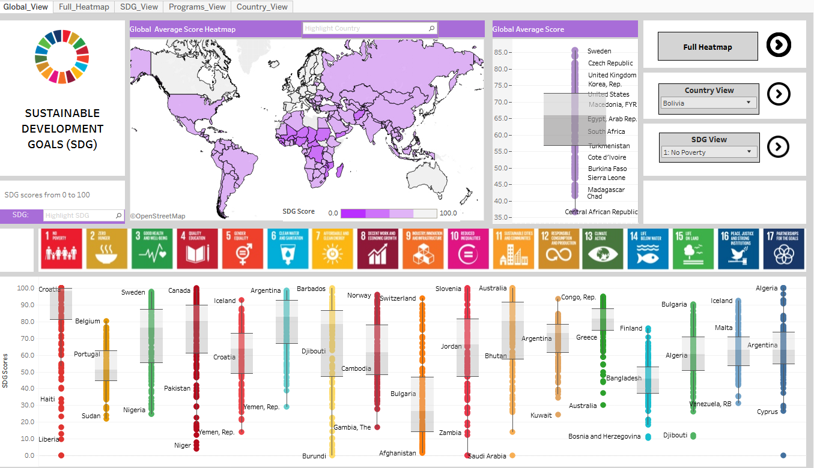
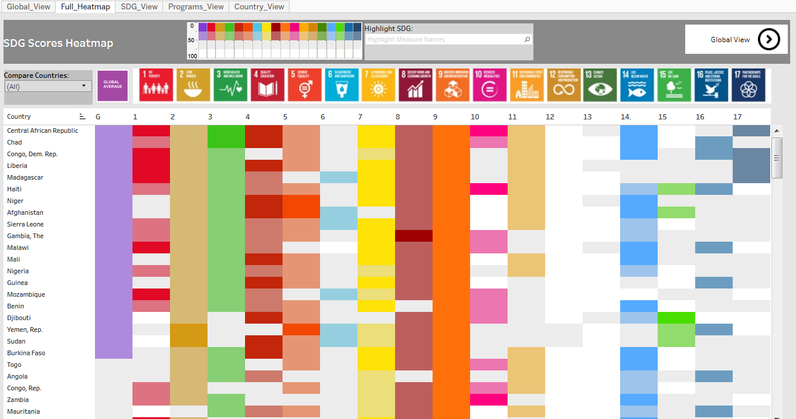

# Sustainable Development Goals

This Project was for UC Bekeley MIDS w209 Class on Data Visualizations. 

The SDG Goals are an agreement by all UN member nations to improve quality of life worldwide by measurable metrics in 17 Goals.
Each goal has several targets and indicators that are quantifiable metrics. 169 total indicators 
   

### Our Project
User: Individuals interested in contribution to meeting SDGs and international aid   
Use Case: Allow a user looking to find an aid program to contribute to that works toward an SDG of interest in a country of the user’s choosing

## Datasets
* [Historic Performance on Indicators](https://data.worldbank.org/data-catalog/millennium-development-indicators)
* [Aggregated Overall Performance](http://www.sdgindex.org/)
* [Projects and Programs](d-portal.org)

Final Presentation:   [209 Final Presentation.pdf](209%20Final%20Presentation.pdf)   
Interactive Viz in Tableau: https://public.tableau.com/shared/PRKTHNDWZ?:display_count=yes   

My contribution to this group project was:
* Main dashboard 
* Full heatmap 
* Navigation across different views

## Dashboard

   

## Heatmap

